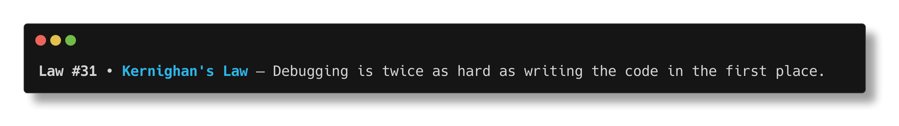

# lose_law

> ***Software engineering has laws. Most teams relearn them the hard way.***

`lose_law` is a tiny terminal command that prints one random Law of Software Engineering. The laws come from [lawsofsoftwareengineering.com](https://lawsofsoftwareengineering.com/), a collection of principles and patterns that shape systems, teams, and decisions.



## Install

Needs `jq`. `curl` is used for install and on the first run.

```bash
mkdir -p "$HOME/.local/bin" && curl -fsSL https://raw.githubusercontent.com/theElandor/lose_law/main/bin/lose.sh -o "$HOME/.local/bin/lose_law" && chmod +x "$HOME/.local/bin/lose_law"
```

If `~/.local/bin` is already in your `PATH`, you can run:

```bash
lose_law
```

If not, add it to your shell startup file.

## Add To Your Shell

### Bash

```bash
printf '\nexport PATH="$HOME/.local/bin:$PATH"\n' >> "$HOME/.bashrc" && . "$HOME/.bashrc"
```

### Zsh

```zsh
printf '\nexport PATH="$HOME/.local/bin:$PATH"\n' >> "$HOME/.zshrc" && . "$HOME/.zshrc"
```

### Fish

```fish
fish_add_path "$HOME/.local/bin"
```

### Other POSIX Shells

```sh
printf '\nexport PATH="$HOME/.local/bin:$PATH"\n' >> "$HOME/.profile" && . "$HOME/.profile"
```

## What Happens

On first run, `lose_law` downloads the JSON feed to `~/.config/lose/laws.json`. After that, each run prints one random law.

## Credit

Special thanks to [Laws of Software Engineering](https://lawsofsoftwareengineering.com/).
